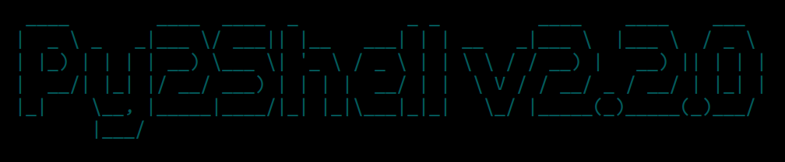

<p align="center">
  
</p>

# Automate Shell Scripting Tool
### Purpose: Project for creating shell scripting using python and javascript object notation

### Requirements
1. Make v4.3+
2. Python 3.10.X or Higher
3. PIP 3.10 or Higher

### How to write a template
1. First navigate to the templates directory `cd templates`.
2. Create the **category** directory name it __basic__ `mkdir -v basic`.
3. Change to the __basic__ directory `cd basic`.
4. Next, create a JSON file and name it _basic.json_ `touch basic.json`.
5. Add the following code to the JSON file `vi basic.json`.
``` json
{
  "name": "math",
  "purpose": "Random Math Applications",
  "category": "basic",    
  "shell.type" : "bash",
  "define.variables" : {
    "var1": "Hello",
    "var2": "There",
    "var3": "Bye",
    "var4": "There"
  },
  "conditions": [
  {
    "type" : "if",
    "goal" : "1 -eq 1",
    "run" : [
    {
      "command_call": {
        "printf": [
          "__BEGIN__",
          "$var1",
          "__SPACE__",
          "$var2",
          "__NEWLINE__",
          "__END__"
        ]
      }
    },
    {
      "command_call": {
        "sleep": [ "1" ]
      }
    }
    ]
  }
  ]    
}
```
4. Save the file and go to the **Example Usage** section of this README.md to create your first shell script. 

### Example Usage
``` sh
# Create a standard script example
$ ./py2shell.py --output basic.sh --datasource basic::basic
```

``` sh
# Create a standard script example and make it executeable
$ ./py2shell.py --output basic.sh --datasource basic::basic --make-executable
```

### Advanced Examples
``` sh
# Create an advanced script example and make it executeable
$ ./py2shell.py --output shift.sh --datasource advanced::shifting_args --make-executable
```


### Test your scripts
1. All script you create are saved into a locally generated directory named **scripts**. 
2. The previously created script is executed using the following commands.
``` sh
$ ./script/basic.sh
```
[- or -]
``` sh
$ source script/basic.sh
```
3. The return value is as follows:
> Bye, There

### How to initialize the locally installed templates
* All of the templates are located in the **templates** directory.
* Initially, you will need to create the location of the main working directory.
* The working directory will store all of the available templates.
* Simply, execute the following command in the command-line interface to setup.

``` sh
./setup.sh --action=init
```

* The previous command will create the default templates.
* List these templates via the following command:
``` sh
./py2shell --templates
```
* Results are as follows:

<pre>
==== Available Templates: ====
1: advanced::shifting_args_extended - An extended example of using the shift command to pass parameters.
2: advanced::shifting_args - An example of using the shift command to pass parameters.
3: default::template_data - A template to test build a generic script.
4: standard::standard - Standard script with help menu, conditions and conditional loops.
5: basic::basic - A basic BASH shell script.
6: basic::math - Random Math Applications
7: animators::animation - Create a flipping animation
8: data::data_cleaner_revised - A BASH revised shell script to clean up a Big Data dataset and save to clean_data.
9: data::data_cleaner - A BASH shell script to clean up a Big Data dataset and save to clean_data.
</pre>

* All of the templates are then stored in the home directory as the name **~/.py2shell/templates**.

### How to update the locally installed templates after modifying
* After you add or modify a template located in the **templates** directory.
* Simply, execute the following command in the command-line interface to update and push to the **~/.py2shell/templates** directory.

``` sh
./setup.sh --action=update
```
* Returns the following output:

<pre>
Pushing, 6 templates
'templates/basic/math.json' -> '/home/denezt/.py2shell/templates/basic/math.json'
'templates/basic/basic.json' -> '/home/denezt/.py2shell/templates/basic/basic.json'
'templates/advanced/shifting_args.json' -> '/home/denezt/.py2shell/templates/advanced/shifting_args.json'
'templates/advanced/shifting_args_extended.json' -> '/home/denezt/.py2shell/templates/advanced/shifting_args_extended.json'
'templates/animators/animation.json' -> '/home/denezt/.py2shell/templates/animators/animation.json'
'templates/default/template_data.json' -> '/home/denezt/.py2shell/templates/default/template_data.json'
'templates/standard/standard.json' -> '/home/denezt/.py2shell/templates/standard/standard.json'
'templates/data/data_cleaner_revised.json' -> '/home/denezt/.py2shell/templates/data/data_cleaner_revised.json'
'templates/data/data_cleaner.json' -> '/home/denezt/.py2shell/templates/data/data_cleaner.json'
</pre>


### Contributors:
<table>
  <tbody>
    <tr>      
      <td align="center">
        <a href="https://github.com/denezt">
          <br />
          <sub><b>denezt</b></sub>
        </a><br />
        <a href="#question-denezt" title="Answering Questions">💬</a>
        <a href="https://github.com/denezt/automate-shell-scripting/commits?author=denezt" title="Documentation">📖</a>
        <a href="https://github.com/denezt/automate-shell-scripting/pulls?q=is%3Apr+reviewed-by%3Adenezt" title="Reviewed Pull Requests">👀</a>
        <a href="#talk-denezt" title="Talks">📢</a>
      </td>
    </tr>
  </tbody>
</table>


