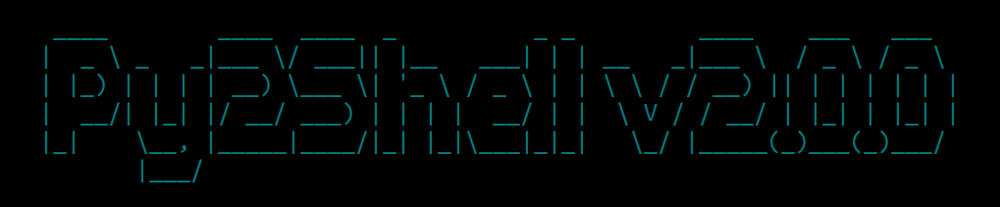

<p align="center">
  
</p>

# Automate Shell Scripting Tool
### Purpose: Project for creating shell scripting using python and javascript object notation

### Requirements
1. Python 3.10.X or Higher
2. PIP 3.10 or Higher

### How to write a template
1. First navigate to the templates directory `cd templates`.
2. Next, create a JSON file and name it _basic.json_ `touch basic.json`.
3. Add the following code to the JSON file `vi basic.json`.
``` json
{
  "shell.type" : "bash",
  "define.variables" : {
    "var1": "Hello",
    "var2": "There",
    "var3": "Bye",
    "var4": "There"
  },
  "conditions": [
  {
    "type" : "if",
    "goal" : "1 -eq 1",
    "run" : [
    {
      "type" : "parameter",
      "printf": "$var1, $var2\\n"
    },
    {
      "type" : "command_call",
      "sleep": [ "1" ]
    }
    ]
  }
  ]    
}
```
4. Save the file and go to the **Example Usage** section of this README.md to create your first shell script. 

### Example Usage
``` sh
# Create a standard script example
$ ./py2shell.py --output basic.sh --datasource basic
```

``` sh
# Create a standard script example and make it executeable
$ ./py2shell.py --output basic.sh --datasource basic --exec
```

### Advanced Examples
``` sh
# Create an advanced script example and make it executeable
$ ./py2shell.py --output basic.sh --datasource shift::shifting_args --exec
```


### Test your scripts
1. All script you create are saved into a locally generated directory named **scripts**. 
2. The previously created script is executed using the following commands.
``` sh
$ ./script/basic.sh
```
[- or -]
``` sh
$ source script/basic.sh
```
3. The return value is as follows:
> Bye, There


### Contributors:
<table>
  <tbody>
    <tr>      
      <td align="center">
        <a href="https://github.com/denezt">
          <br />
          <sub><b>denezt</b></sub>
        </a><br />
        <a href="#question-denezt" title="Answering Questions">💬</a>
        <a href="https://github.com/denezt/automate-shell-scripting/commits?author=denezt" title="Documentation">📖</a>
        <a href="https://github.com/denezt/automate-shell-scripting/pulls?q=is%3Apr+reviewed-by%3Adenezt" title="Reviewed Pull Requests">👀</a>
        <a href="#talk-denezt" title="Talks">📢</a>
      </td>
    </tr>
  </tbody>
</table>


